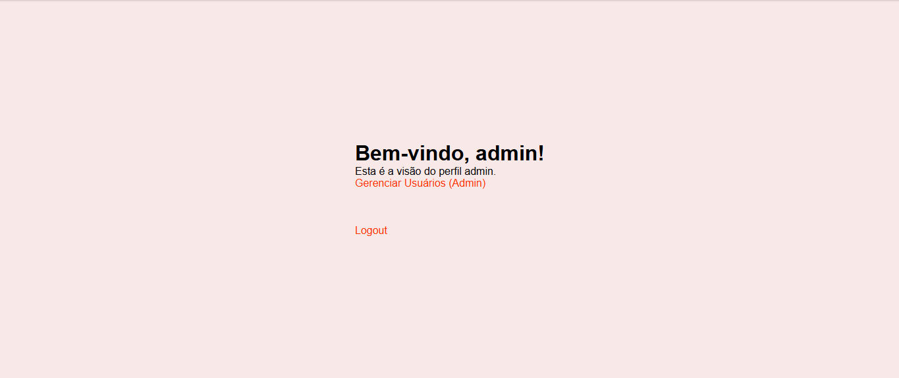

# Projeto de Sistema de Login e Cadastro com PHP e Banco de Dados

## Descrição

Este projeto foi desenvolvido em sala de aula com o objetivo de implementar um sistema de login e cadastro utilizando PHP e MySQL. O sistema possui uma tela de login e outra de cadastro, além de uma validação de nível de acesso dos usuários (Admin, Colaborador, ou Gestor) com base nas informações armazenadas no banco de dados.

## Funcionalidades

- **Cadastro de Usuário**: Uma interface onde os usuários podem se registrar com dados pessoais, incluindo um campo para definir o tipo de usuário.
- **Login de Usuário**: Interface de login onde os usuários inserem suas credenciais (e-mail e senha) para acessar o sistema.
- **Autenticação e Autorização**: Após o login, o sistema verifica as credenciais e consulta o banco de dados para identificar o nível de acesso do usuário. Dependendo do resultado, ele será direcionado para a página correspondente:
  - **Admin**: Acesso ao painel de administração.
  - **Colaborador**: Acesso à área de colaborador.
  - **Gestor**: Acesso à área de gestão.

## Tecnologias Utilizadas

- **Linguagem de Programação**: PHP
- **Banco de Dados**: MySQL
- **Frontend**: HTML5, CSS3
- **Servidor Web**: XAMPP (ou outro servidor compatível com PHP)

## Como Executar o Projeto

1. **Pré-requisitos**:
   - Ter o XAMPP ou outro servidor local compatível com PHP e MySQL instalado.
   - Configurar o banco de dados MySQL.

2. **Configuração do Banco de Dados**:_
   - Crie um banco de dados chamado `sistema_usuarios`.
  

3. **Configuração do Projeto**:
   - Clone o repositório ou baixe os arquivos do projeto.
   - Mova os arquivos para a pasta `htdocs` do seu servidor local (caso esteja utilizando o XAMPP).
   - No arquivo `database.php`, configure as credenciais de acesso ao banco de dados:

4. **Acessando o Sistema**:
   - Abra o navegador e vá para `http://localhost/nome_do_projeto/`.
   - Utilize a página de cadastro para registrar novos usuários.
   - Faça login para testar o sistema.

## Telas
 

## Estrutura do Projeto

- `index.php`: Página inicial do projeto com o formulário de login.
- `register.php`: Tela de cadastro de novos usuários.
- `database.php`: Arquivo de configuração do banco de dados.
- `style.css`: Pasta contendo os arquivos CSS do projeto.

## Estrutura do Banco de Dados

O banco de dados contém uma tabela principal `usuarios` com os seguintes campos:

- `id`: ID do usuário (chave primária, auto-incremento).
- `nome`: Nome completo do usuário.
- `email`: Endereço de e-mail do usuário.
- `senha`: Senha criptografada.
- `perfil`: Define se o usuário é 'Admin', 'Colaborador', ou 'Gestor'.

## Contribuição

Este projeto foi desenvolvido como parte de um exercício de aprendizado em sala de aula com o auxilio e ensino do professor <a href="https://github.com/leonardossrocha">Leonardo Rocha</a>. Sinta-se à vontade para contribuir ou fazer melhorias.

## Licença

Este projeto é de uso educacional e não possui uma licença específica.
